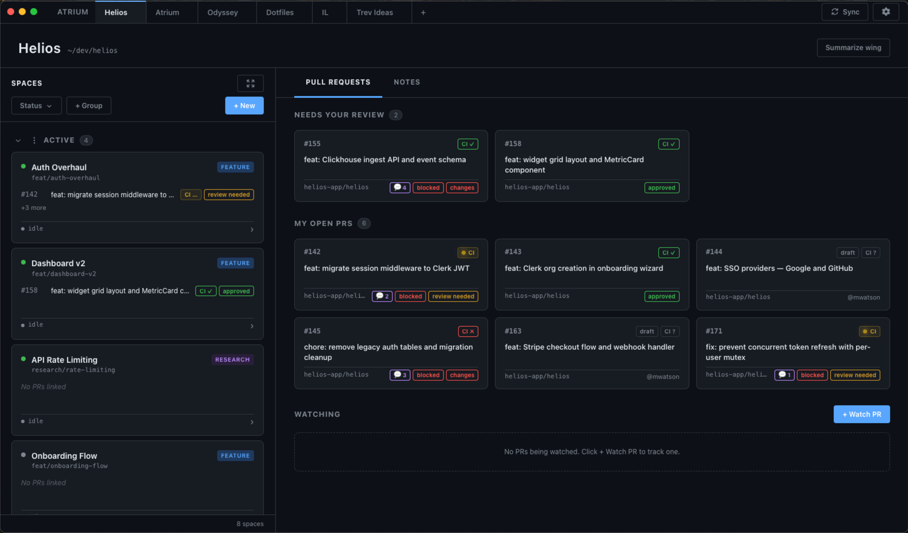
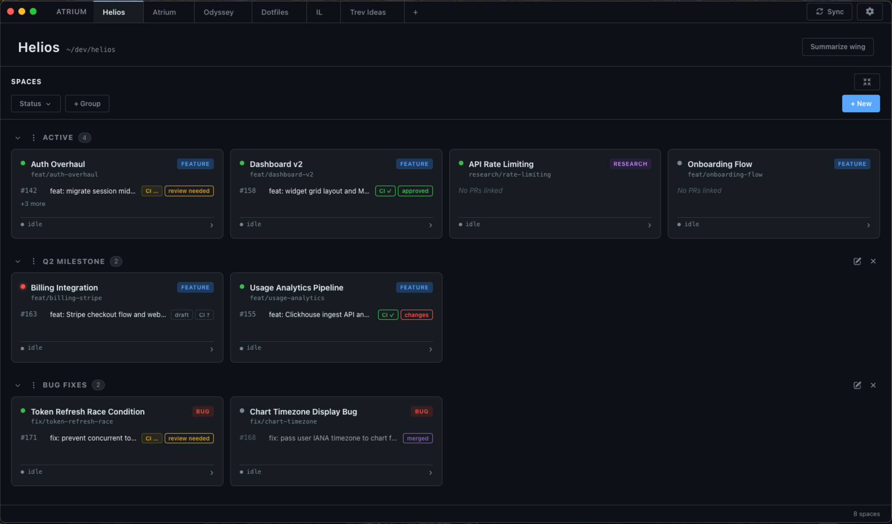
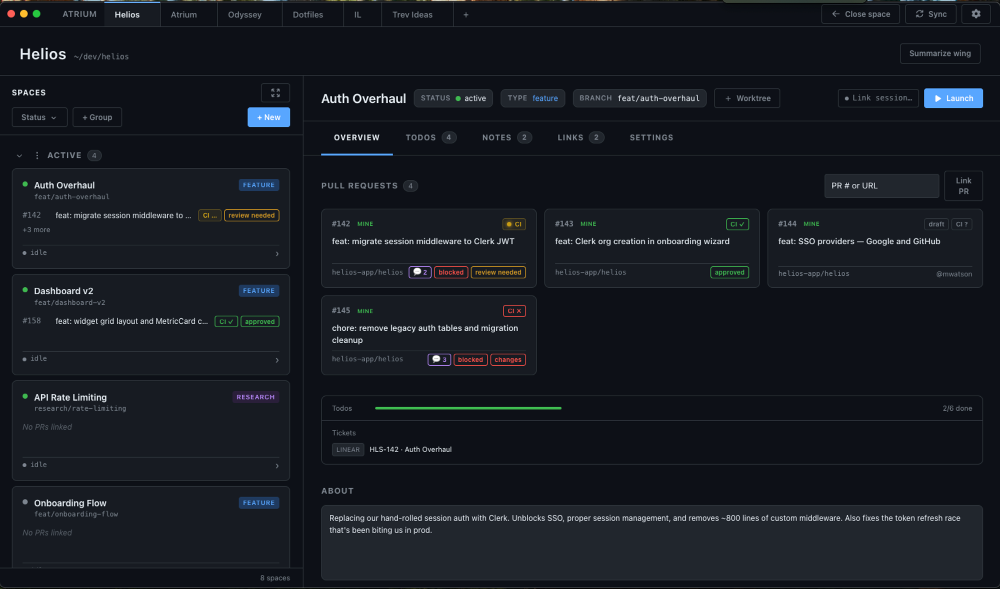
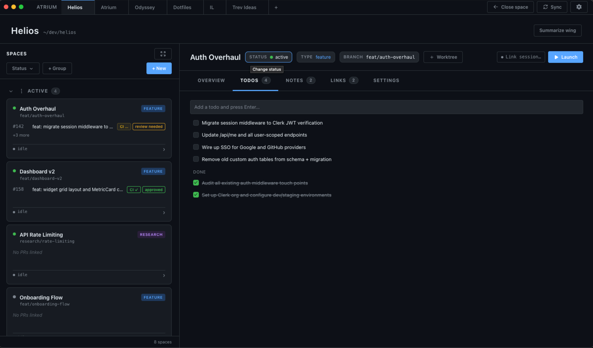
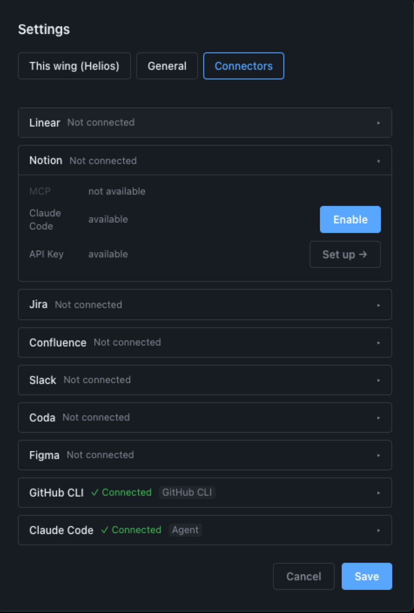
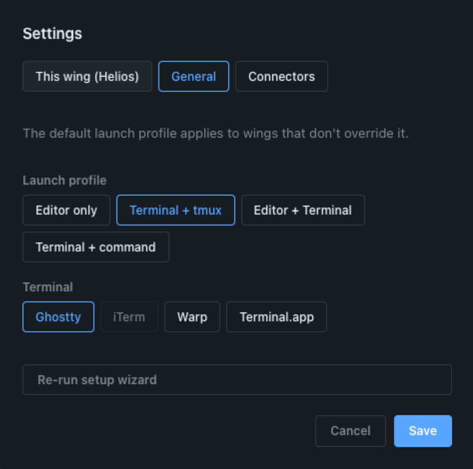

# Atrium

A macOS dashboard for orchestrating development work across multiple projects. Tracks workstreams, pull requests, and Claude Code sessions from a single window.



## Table of Contents

- [Getting Started](#getting-started)
- [Core Concepts](#core-concepts)
  - [Models](#models)
  - [Connectors](#connectors)
  - [Workspace Launcher](#workspace-launcher)
  - [AI Tooling](#ai-tooling)
- [Contributing](#contributing)

---

## Getting Started

**Requirements:** macOS, Node.js 20+, [`gh` CLI](https://cli.github.com), [`claude` CLI](https://claude.ai/claude-code)

```bash
gh auth login          # authenticate GitHub CLI
npm install
npm run dev
```

On first launch: create your first Wing, then configure connectors in the Connectors panel for any external services you use.

---

## Core Concepts

### Models

Everything in Atrium is organized around three nested concepts.

**Wings** are project scopes: the top-level container. A Wing typically maps to a team, a product area, or a long-running initiative. You switch between Wings via the tab bar, and each Wing has its own Spaces, watched PRs, connector config, and launch profile.



**Groups** organize Spaces within a Wing. You can create custom groups to organize by milestone, workstream, or whatever structure fits your work.

**Spaces** are the unit of work: a single workstream, feature, bug fix, or research spike. A Space holds everything relevant to that workstream in one place:

- **Pull requests**: linked PRs with live status: CI checks, review decisions, and merge state
- **Notes**: freeform notes scoped to this workstream
- **Todos**: a checklist of tasks scoped to this workstream
- **About**: a freeform description of what the workstream is working on, its goals, and key decisions
- **Links**: URLs to tickets, docs, designs, threads, and any other relevant resources (enriched with live metadata via connectors)
- **Branch and worktree**: the local branch and working directory for this workstream; optionally backed by a dedicated git worktree
- **Status**: Active, Blocked, Done, or Archived; Blocked surfaces the Space visually so nothing slips





### Connectors

Connectors bring external data into your Spaces. When you add a link to a Space: a Linear ticket, a Notion doc, a Jira issue: the connector fetches live metadata from that system and surfaces it inline: title, status, assignee, priority. The link stays current without you having to open the source.

Connectors are configured per Wing in the Connectors panel. Once connected, enrichment happens automatically.

Supported: GitHub, Linear, Notion, Jira, Confluence, Slack, Discord, Figma, Coda.



### Workspace Launcher

A Space already knows its directory, branch, and full context. The launcher uses that to drop you back into a workstream without having to reconstruct where you were.

Each Wing has a launch profile: your preferred editor (VS Code, Cursor), terminal (Ghostty, iTerm2, Warp, Terminal), and optionally a tmux layout. Launching a Space opens your editor at the right directory and starts (or reattaches to) a named tmux session with `claude` pre-loaded with the Space's todos, notes, PRs, and branch already in context. If you've worked in the Space before, the prior Claude session is resumed automatically.

The goal: one click to go from the dashboard to a ready-to-work environment, with no setup overhead.



### AI Tooling

Atrium integrates with Claude in two ways.

**Generative summaries.** You can generate a digest for any Space: a short summary covering what's being worked on, current state, and blockers: synthesized from the Space's PRs, notes, todos, and links. Wing-level summaries aggregate across all active Spaces, structured as Overview, By Space, Blockers, and Next Steps. When connectors are configured, Claude can pull full ticket and doc bodies via MCP to produce richer summaries.

**Session monitoring.** Atrium watches each Space's Claude Code session log and surfaces a live status badge directly on the Space card: `working`, `needs-input` (awaiting a tool-use permission), `idle`, or `no-session`. You can see at a glance which agents are running, which are stuck waiting for you, and which are finished: without switching into each terminal. The Space detail also shows Claude's latest session recap (the `away_summary` Claude writes when it finishes a working session), which can be promoted directly to the Space's About field.

---

## Contributing

**Architecture.** Atrium is an Electron app written in TypeScript with a React renderer. The main process owns everything that touches the system: filesystem, GitHub API, spawning terminals and editors, running `claude`, and all connector integrations. The renderer is a standard React app. The two communicate over a typed IPC bridge exposed via the preload script as `window.api`.

**Data.** All state is stored as plain JSON in `~/.atrium/`: Wings, Spaces, config, and watched PRs. Easy to inspect, back up, or reset. Connector secrets (API keys, tokens) are stored in the system keychain, not on disk.

**Styling.** The project uses Tailwind v4 with an ongoing migration from semantic `@apply` classes to inline utilities. Read `CLAUDE.md` before touching any styles: it documents the migration rules, design tokens, and spacing scale.

**To contribute:**

1. Branch off `main` and open a PR.
2. Run `npx tsc --noEmit` before pushing.
3. Keep PRs small and scoped to one change.
